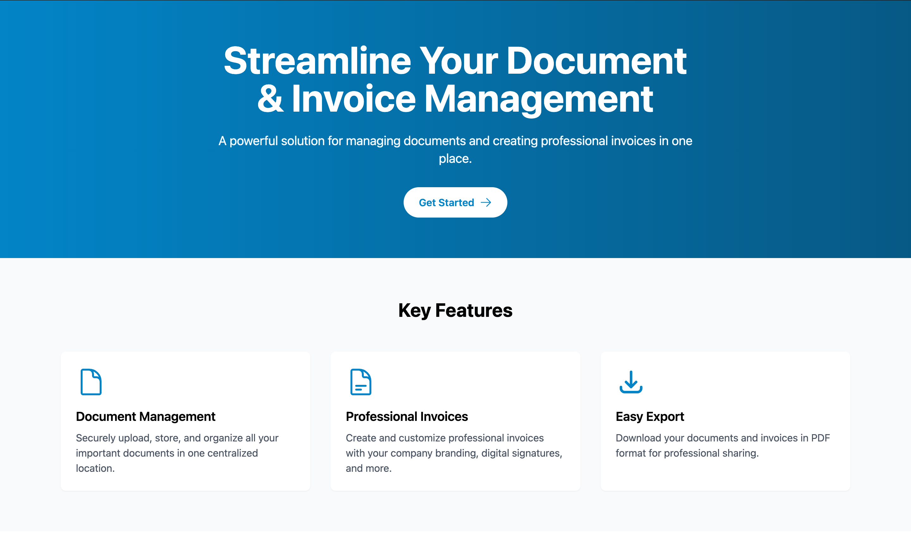
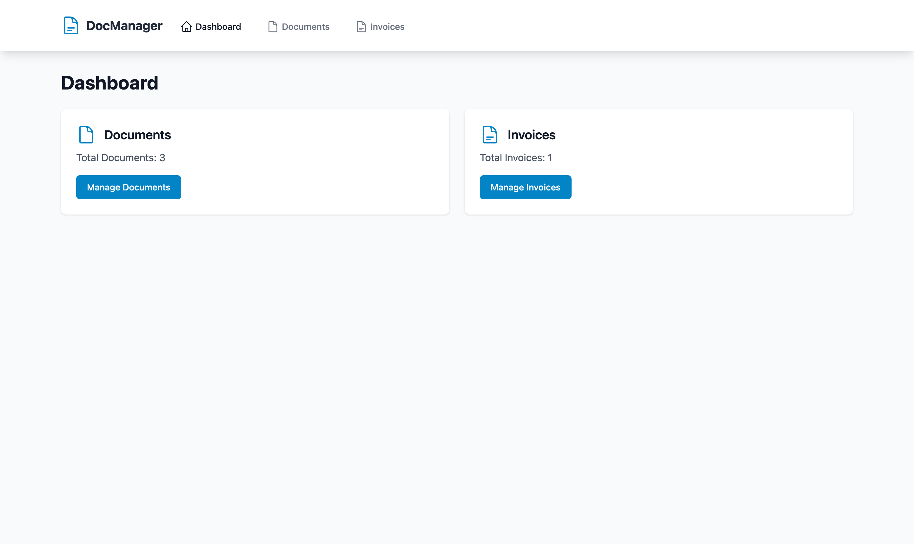
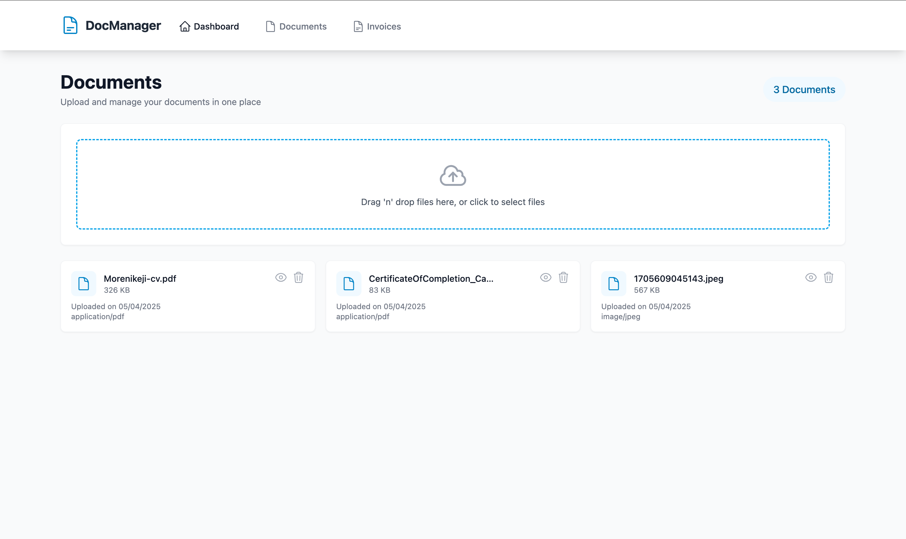
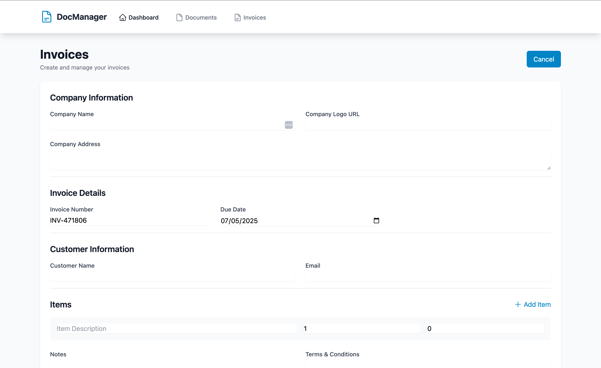

# 📄 Document Manager

A powerful solution for managing documents and creating professional invoices — all in one place.

## 🚀 Overview

**Document Manager** is a streamlined web application built with React + Vite, Redux Toolkit, and Tailwind CSS. It allows users to upload, organize, and download important documents. In addition, users can easily generate professional invoices and export them in PDF format.

---

## ✨ Key Features

- 📁 **Document Management**  
  Securely upload, store, view, and manage all your important documents in one centralized location.

- 🧾 **Professional Invoices**  
  Create and customize professional invoices with branding, digital signatures, and more.

- 📤 **Easy Export**  
  Instantly download both documents and invoices in PDF format for easy sharing.

---

## 🖼 Screenshots

### 🔹 Landing Page & Key Features

### 🔹 Document Overview & Features

### 🔹 Document List, Upload & Management

### 🔹 Invoice Dashboard Overview

### 🔹 Invoice Input Details & Management

---

## 🛠 Built With

- **React + Vite** – Fast frontend framework & bundler
- **Redux Toolkit** – Efficient global state management
- **Tailwind CSS** – Utility-first modern styling

---